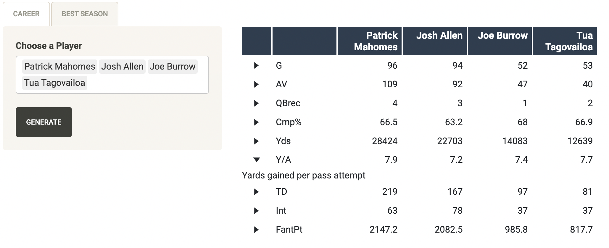
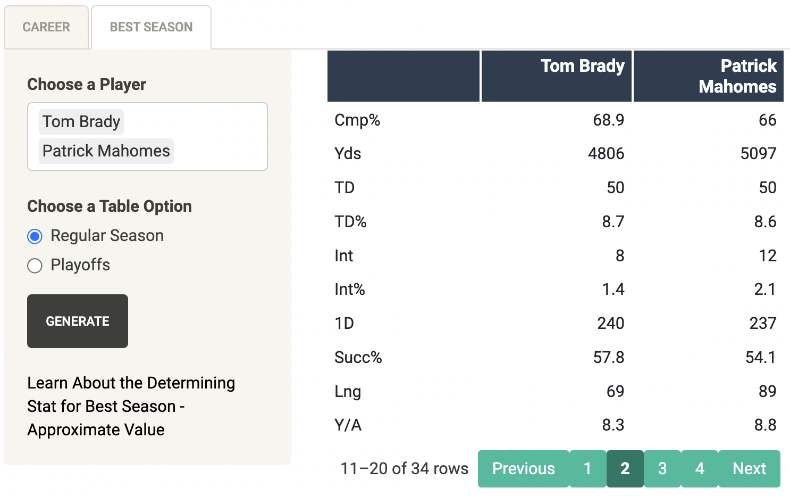
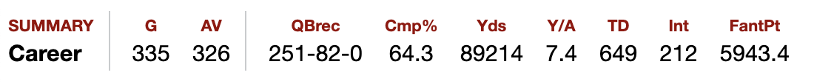

```{r setup, include=FALSE}
knitr::opts_chunk$set(echo = FALSE)
```

# Background

-   This data is scraped from the pro football reference website, <https://www.pro-football-reference.com/>.

**Goals:**

-   Improve upon web scraping abilities.
-   Deal with error handling present in web scraping.
-   Produce a shiny app to visualize the specified data.

# Web Scraping

The data is scraped using the rvest package from each players personal URL at the link above.

Getting the URLs:

1.  Base URL

    $\color{green}{\text{a = https://www.pro-football-reference.com/players/}}$

2.  Use user selection to select player and select proper characters (firstInitial/firstFourLastNamefirstTwoFirstName)

    $\color{blue}{\text{b = B/BradTo}}$

3.  Determine the correct number for the quarterback

    $\color{red}{\text{c = 00}}$

4.  Add the final piece

    $\color{purple}{\text{d = .htm}}$

$\color{green}{\text{a}}$ + $\color{blue}{\text{b}}$ + $\color{red}{\text{c}}$ + $\color{purple}{\text{d}}$ = "$\color{green}{\text{https://www.pro-football-reference.com/players/}}$$\color{blue}{\text{B/BradTo}}$$\color{red}{\text{00}}$$\color{purple}{\text{.htm}}$"

# Wrangling the Data

The career data was not in table format on the site, so it needed to be scraped as html text and transformed into a data table.

The original text:

```{r, message=FALSE, warning=FALSE, out.width='100%', fig.align='center'}
library(tidyverse)
library(rvest)
source("scraping_functions.R")
url <- get_url("Tom Brady")
document <- read_html(url)
url_text <- document |> html_elements("p") |> html_text2()
url_text[10]
url_text[11]
url_text[12]
```

The refined data table:

```{r, message=FALSE, warning=FALSE}
library(reactable)
columns = c("QB", "G", "AV", "QBrec", "Cmp%", "Yds", "Y/A", "TD", "Int", "FantPt")
df = data.frame(matrix(nrow = 0, ncol = length(columns)))
colnames(df) = columns
document <- read_html(url)
i <- which(url_text == "Career")
if ((url_text[i-1] == "2023")){
   player <- c("Tom Brady", as.numeric(url_text[i+2]), as.numeric(url_text[i+4]), url_text[i+6], as.numeric(url_text[i+8]), as.numeric(url_text[i+10]), as.numeric(url_text[i+12]), as.numeric(url_text[i+14]), as.numeric(url_text[i+16]), as.numeric(url_text[i+18]))
   df <- rbind(df, player)
} else{
   player <- c("Tom Brady", as.numeric(url_text[i+1]), as.numeric(url_text[i+2]), url_text[i+3], as.numeric(url_text[i+4]), as.numeric(url_text[i+5]), as.numeric(url_text[i+6]), as.numeric(url_text[i+7]), as.numeric(url_text[i+8]), as.numeric(url_text[i+9]))
   df <- rbind(df, player)
}
colnames(df) = c("QB", "G", "AV", "QBrec", "Cmp%", "Yds", "Y/A", "TD", "Int", "FantPt")
df <- df |> mutate_at(vars(c('G', 'AV', 'Cmp%', 'Yds', 'Y/A', 'TD', 'Int', 'FantPt')), as.numeric)
df <- data.matrix(df)
df <- t(df)
df <- data.frame(df)
colnames(df) = "Tom Brady"
df <- df |> slice(-1)
reactable(head(df, 2), bordered = TRUE, compact = TRUE)
```

# Data Tables

## **Career Tab**

The career tab allows the user to select up to 5 players to compare their career statistics. There are drop-down bars to describe each stat to the user.

```{r standard-figure, fig.align='center', fig.height=30, message=FALSE, warning=FALSE, out.width='100%'}
library(knitr)

```

## **Best Game Tab**

The best game tab allows the user to select up to 2 players to compare the statistics for their best seasons. The best season is determined by the Approximate Value given by the nfl-football-reference site. If a player has two seasons with their highest AV, completion percentage for each season is considered.

```{r standard-figure-2, fig.align='center', fig.height=10, message=FALSE, warning=FALSE, out.width='100%'}

```

-   The user may also choose to see their playoff stats as well.

# App QR Code

```{r standard-figure-3, fig.align='center', fig.height=3, fig.width=3}
library(qrcode)
code <- qr_code("https://stlawu.shinyapps.io/nfl_qb_comparison/")
plot(code)
```

# Error Handling

One of the main parts of this project was dealing with the errors involved in web scraping. These are some of the main errors I had while creating this app:

-   HTTP Error 429 - Too many requests. The site I was using only allowed me to scrape 10 times in a minute, which began to cause issues when attempting to compare up to 10 players originally. This is why there is a generate button to load the table and a limit on the number of players.

-   Error Fix: If names are too short, x's are used as placeholders.

-   Error Fix: Some players have the same name, so a loop was added here to make sure the player being displayed is a quarterback.

    -   This issue was found when looking at current Bills quarterback Josh Allen.
        -   Original URL generated for Josh Allen: <https://www.pro-football-reference.com/players/A/AlleJo00.htm>
        -   The correct URL: <https://www.pro-football-reference.com/players/A/AlleJo02.htm>. (The only different is the number 2)

-   Error Fix: Current players have a different html_text than retired players that contains 2023 stats as well as career.

pro-football-reference summary for current players:

```{r standard-figure-4, fig.align='center', fig.height=10, message=FALSE, warning=FALSE, out.width='100%'}
knitr::include_graphics("2023.png")
```

pro-football-reference summary for retired players:

```{r standard-figure-5, fig.align='center', fig.height=10, message=FALSE, warning=FALSE, out.width='100%'}

```

# Packages Used

-   The **rvest** package was used in this project to scrape data from the website. These are a few main parts of the packages I used:
    -   read_html() was used to read in the entire html document.
    -   html_text2() was used for the first table generated in the app.
    -   html_nodes() was used to scrape the second table generated.
-   The **reactable** package was used to generate the tables in a more user friendly way.
    -   I used the flatly() theme in the reactable package, in addition to making the tables more compact and bordered.

# Future Work

-   I would like to scrape all of this data and attempt to model the changes in stats depending on the rule changes in the NFL.
